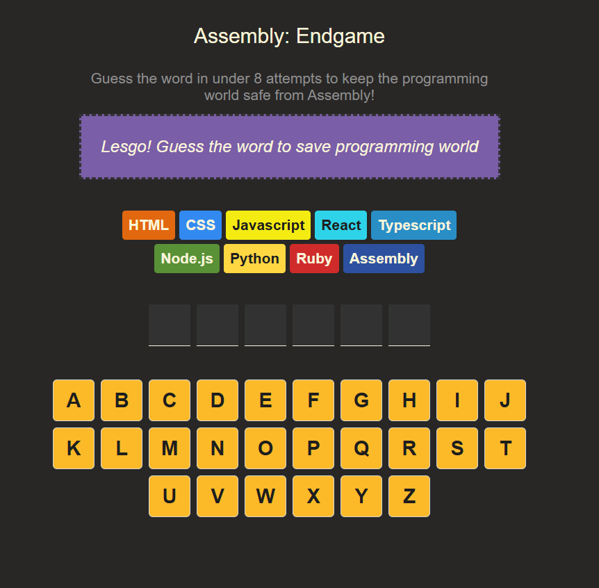
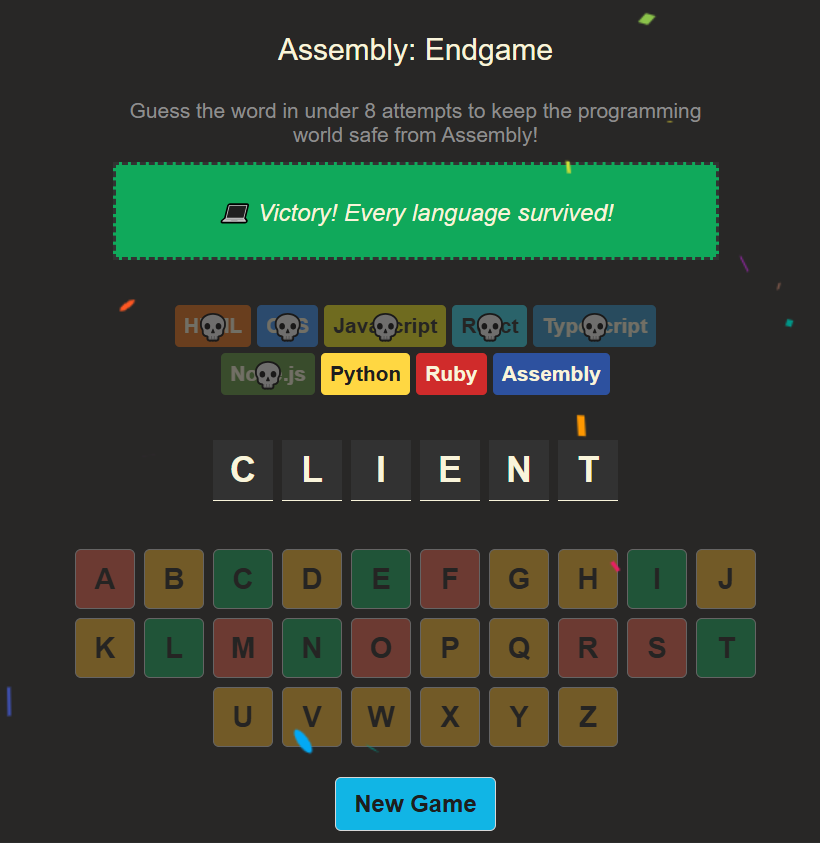
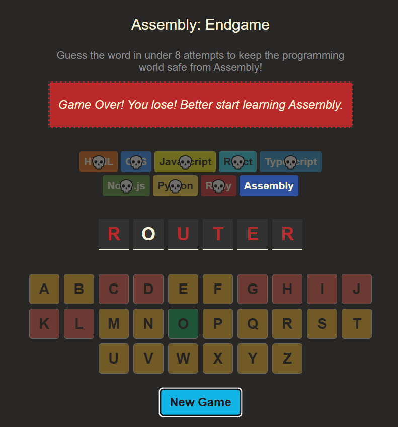

# Assembly: Endgame

A Hangman-inspired word guessing game built with React where every incorrect guess eliminates a programming language. Guess the hidden programming-related word before all languages fall to Assembly and save the programming world.

## Live Demo

https://hangman-assembly.vercel.app/

## ✨ Features

- Random programming-themed word every game
- Interactive on-screen keyboard
- Real-time letter reveal for correct guesses
- Color-coded keyboard feedback for correct and incorrect guesses
- Programming languages are eliminated after each wrong guess
- Dynamic game status messages for wins, losses, and guesses
- Confetti celebration on victory
- Keyboard buttons are disabled after being guessed
- One-click game restart
- Fully responsive design for desktop and mobile

## 🛠️ Tech Stack

- React
- JavaScript (ES6+)
- Vite
- CSS3
- React Confetti

## 📸 Preview

<p align="center">
  
  
</p>

<p align="center">
  
</p>

## 📚 What I Learned While Building This

Building this project strengthened my understanding of React by implementing game mechanics from scratch rather than following a simple CRUD workflow. Some of the key concepts I practiced include:

- Managing application state with React Hooks.
- Rendering dynamic UI using conditional rendering and array mapping.
- Designing reusable React components with well-structured props.
- Working with string and array methods to implement game logic.
- Tracking correct and incorrect guesses efficiently.
- Building responsive layouts using modern CSS.
- Organizing application data into reusable modules.
- Creating interactive UI feedback through conditional styling.
- Handling user interactions while preventing duplicate inputs.
- Structuring a React project into maintainable, reusable components.
- Using Git and GitHub with meaningful commits throughout development.

## 🚀 Getting Started

### 1. Clone the repository

```bash
git clone https://github.com/ajwazameer/assembly-endgame.git
cd assembly-endgame
```

### 2. Install dependencies

```bash
npm install
```

### 3. Start the development server

```bash
npm run dev
```

Open the URL shown in your terminal (usually **http://localhost:5173**).

## 📂 Project Structure

```
src/
│
├── components/
│   ├── Header.jsx
│   ├── GameStatus.jsx
│   ├── LanguageList.jsx
│   ├── Word.jsx
│   ├── Keyboard.jsx
│   └── Button.jsx
│
├── data/
│   ├── words.js
│   ├── letters.js
│   ├── language.js
│   └── messages.js
│
├── Main.jsx
├── App.jsx
└── main.jsx
```

## 💡 How It Works

1. A random programming-related word is selected.
2. The player guesses letters using the on-screen keyboard.
3. Correct guesses reveal matching letters in the hidden word.
4. Incorrect guesses eliminate one programming language.
5. The game continues until the word is guessed or all languages are eliminated.
6. The player can instantly start a new game with the restart button.

## 🚧 Future Improvements

- Multiple difficulty levels
- Sound effects and background music
- Timed game mode
- Score tracking and statistics
- Daily challenge mode
- Leaderboard support

## 📄 License

This project is licensed under the MIT License.
